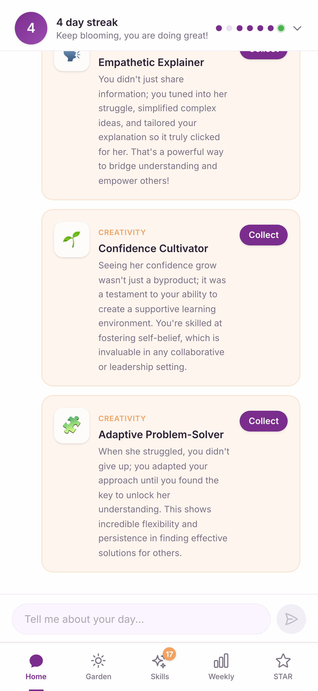
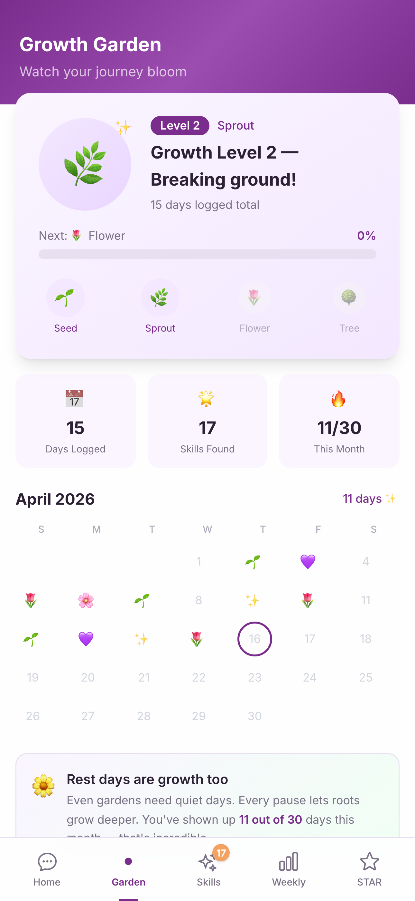
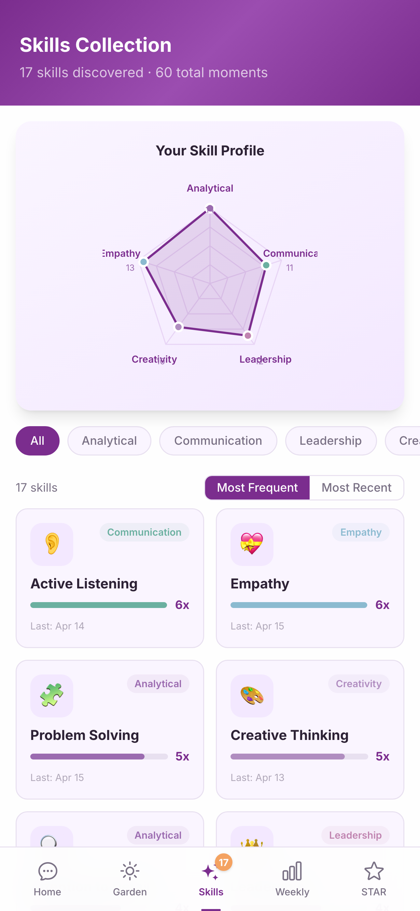
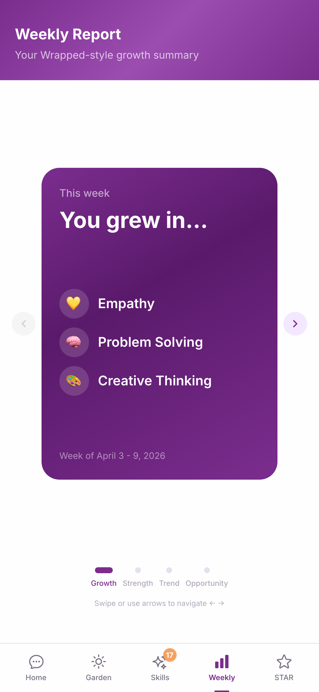
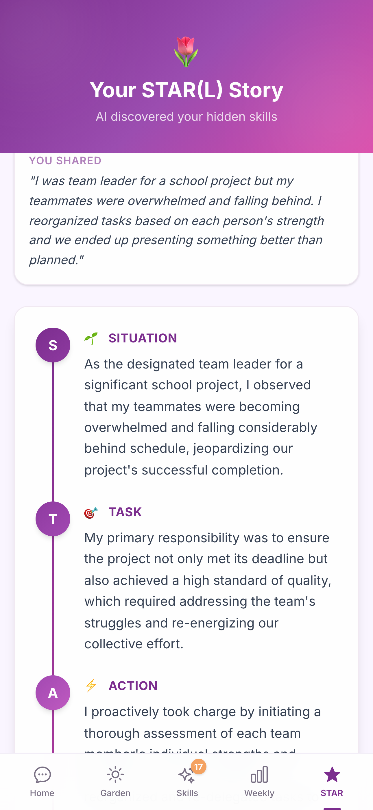
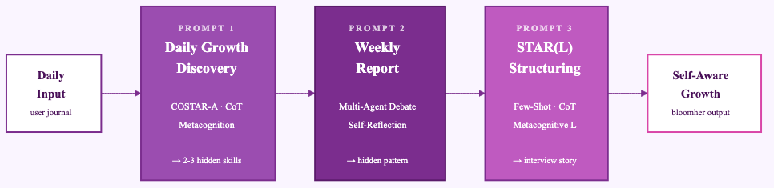
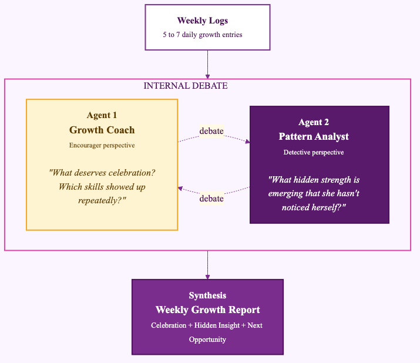

<div align="center">

# 🌷 BloomHer

### An AI mirror that reveals the skills women dismiss in themselves.

*Women apply for jobs only when they meet 100% of requirements. Men apply at 60%.*<br/>
*The gap isn't skills. It's **recognition**.*

<br/>

[](./submission/video/BloomHer_Video.mp4)
[](./submission/BloomHer_Submission.pdf)
[](./prompts/)

Built for **[AI Skills 4 Women](https://founderz.com/blog/ai-skills-4-women-2026/)** — Founderz × Microsoft, Class of 2026.

</div>

<br/>

---

## 💭 Why BloomHer

Every woman has done something remarkable today. She won't mention it. She doesn't see it yet.

BloomHer is a prompt-engineered AI companion that listens to a thirty-second journal entry and surfaces the hidden skills a woman is already practicing — named, connected to professional competencies, and gently reflected back.

This project is my exploration of *prompt engineering as product design*, not just prompt writing.

<br/>

---

## 💻 App screens

<div align="center">

<table>
<tr>
<td align="center" width="20%"><br/><sub><b>Chat</b><br/>Prompt 1 in action</sub></td>
<td align="center" width="20%"><br/><sub><b>Garden</b><br/>daily bloom streak</sub></td>
<td align="center" width="20%"><br/><sub><b>Skills</b><br/>5-dimension radar</sub></td>
<td align="center" width="20%"><br/><sub><b>Weekly</b><br/>Wrapped-style cards</sub></td>
<td align="center" width="20%"><br/><sub><b>STAR(L)</b><br/>interview story</sub></td>
</tr>
</table>

</div>

<br/>

---

## 🌿 How it works

One growth loop. Three engineered prompts. Five screens.

<div align="center">

</div>

A thirty-second journal becomes **a named skill**. A week of those becomes **a growth story**. And when you need it — **an interview-ready narrative**.

<br/>

---

## 🍀 The three engineered prompts

| # | Prompt | Techniques stacked | What it does |
|---|---|---|---|
| 1 | **[Daily Growth Discovery](./prompts/prompt1_daily_growth.md)** | COSTAR-A · Chain-of-Thought · Metacognitive Prompting · Persona | Turns a 30-second journal into 2–3 named skills |
| 2 | **[Weekly Report](./prompts/prompt2_weekly_report.md)** | Multi-Agent Debate · Self-Reflection · COSTAR-A · Pattern Recognition | Two AI personas debate, then synthesize a growth story |
| 3 | **[STAR with L](./prompts/prompt3_starl_structuring.md)** | Few-Shot · Chain-of-Thought · Scaffolded Translanguaging · Metacognitive Activation | Restructures raw experience into an interview-ready narrative |

The **"L" in STAR(L)** is an original extension I added to the classic STAR framework — it stands for **Learned**, the metacognitive shift from *what I did* to *what it says about me*.

<br/>

### The Multi-Agent Debate in Prompt 2

<div align="center">

</div>

Before generating the weekly report, the model debates internally between **Growth Coach** (encourager) and **Pattern Analyst** (detective), then synthesizes — grounded in [Du et al., 2023](https://arxiv.org/abs/2305.14325).

<br/>

---

## 🌎 Grounded in research, not vibes

Every technique cites a specific paper.

| Technique | Citation |
|---|---|
| COSTAR-A Framework | *adaptive prompting framework*, 2025 |
| Multi-Agent Debate | Du, Li, Torralba, Tenenbaum, Mordatch — NeurIPS 2023 |
| Metacognitive Prompting | Mazari — 2025 |
| Chain-of-Thought | Wei et al. — NeurIPS 2022 |
| Few-Shot Learning | Brown et al. — NeurIPS 2020 |
| **STAR(L)** | **original extension by Somi Jeong — this project** |

<br/>

---

## 💭 v2 — shaped by Founderz Fellow feedback

A Fellow reviewer wrote:

> *"BloomHer addresses a genuinely important tension: women often do not lack evidence of capability; they lack a language for seeing and naming it. Your transcript shows that you are thinking about **prompt engineering as product design**, not just prompt writing. You are already working with a **builder's discipline**."*

Three suggestions landed, and this version implements each:

| Feedback | v2 response |
|---|---|
| *"Chain-of-thought is often better as observable output steps rather than internal reasoning"* | **Observable CoT.** Every AI response now returns a visible `reasoningSteps` array, rendered as a collapsible *"How I arrived at this"*. Glass box, not black box. |
| *"A verification step where the user confirms or edits the inferred skills would strengthen trust"* | **Human-in-the-loop verification.** Every skill has *Sounds right* / *Let me edit* / *Not quite* controls. Edits are persisted; rejected skills feed back into future iterations. |
| *"Document what changed between v1, v2, v3"* | **Iteration log + failed version.** The v0.9 "fortune cookie" prompt is preserved [alongside the iteration table](./prompts/prompt1_daily_growth.md). |

<br/>

---

## 🌷 Tech stack

<div align="center">


</div>

- **Frontend** — React 19 · TypeScript · Vite 6 · Tailwind CSS v4
- **AI** — Gemini 2.5 Flash via REST (Grok fallback · mock fallback for offline)
- **Persistence** — `localStorage` with soft-migrating schema evolution
- **Testing** — Playwright e2e (16 / 16 passing across all flows)
- **Voice** — Azure Speech Studio (`en-US-AriaNeural`, gentle + cheerful styles)
- **Video** — FFmpeg compositing of slides + narration

<br/>

---

## 💻 Run locally

```bash
git clone https://github.com/1wos/bloomHer.git
cd bloomHer/app
npm install

# Optional — mock fallback works without a key
echo "VITE_GEMINI_API_KEY=your_key_here" > .env

npm run dev   # → http://localhost:5173
```

End-to-end tests:

```bash
# From repo root
node bloomher-e2e.mjs   # 16 checks across Chat, STAR(L), Garden, Skills, Weekly
```

<br/>

---

## 🌿 Submission artifacts

| | |
|---|---|
| 📼 **3-minute video** | [submission/video/BloomHer_Video.mp4](./submission/video/BloomHer_Video.mp4) |
| 📄 **Pitch deck (PDF)** | [submission/BloomHer_Submission.pdf](./submission/BloomHer_Submission.pdf) |
| 🎨 **Pitch deck (PPTX)** | [submission/BloomHer_Submission.pptx](./submission/BloomHer_Submission.pptx) |
| 🧩 **Full prompts** | [prompts/](./prompts/) |
| 🏗️ **Build scripts** | [submission/video/](./submission/video/) |
| 🎬 **Slide source (HTML)** | [submission/slides/](./submission/slides/) |

<br/>

---

## 💗 Built by

**Somi Jeong** — because every woman has a garden already blooming. BloomHer is just the lens.

<div align="center">
<br/>

*"Every small action builds something bigger — and you are building more than you realize."*

🌷

</div>
